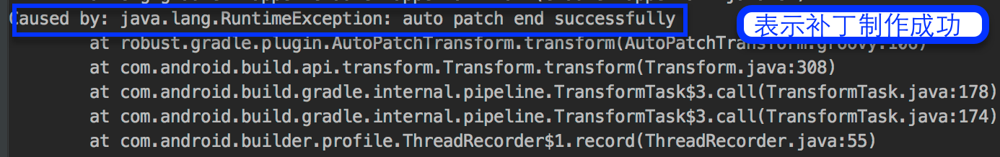

# Robust
 [ ](https://bintray.com/meituan/maven/com.meituan.robust%3Apatch/0.4.99/link)
 [](https://github.com/Meituan-Dianping/Robust/pulls)
 [](https://raw.githubusercontent.com/Meituan-Dianping/Robust/master/LICENSE)  


 Robust是新一代热更新系统，无差别兼容Android2.3-10版本；无需重启补丁实时生效，快速修复线上问题，补丁修补成功率高达99.9%。

 [English Introduction](README.md)

  关于如何自定义以及常见问题的解决，请参看 [Wiki](https://github.com/Meituan-Dianping/Robust/wiki)

# 环境

 * Mac Linux Windows
 * Gradle 2.10+ , include 3.0
 * Java 1.7 +

# 使用方法

 1. 在App的build.gradle，加入如下依赖

	```java
	apply plugin: 'com.android.application'
	//制作补丁时将这个打开，auto-patch-plugin紧跟着com.android.application
	//apply plugin: 'auto-patch-plugin'
	apply plugin: 'robust'
		
		
	compile 'com.meituan.robust:robust:0.4.99'
		
	```
 2. 在整个项目的build.gradle加入classpath

	```java
	 buildscript {
	    repositories {
	        jcenter()
	    }
	    dependencies {
	         classpath 'com.meituan.robust:gradle-plugin:0.4.99'
	         classpath 'com.meituan.robust:auto-patch-plugin:0.4.99'
	   }
	}
	```
3. 在项目的src同级目录下配置robust.xml文件，具体项请参考DEMO**app/robust.xml**

# 优势

* 支持Android2.3-10版本
* 高兼容性、高稳定性，修复成功率高达99.9%
* 补丁实时生效，不需要重新启动
* 支持方法级别的修复，包括静态方法
* 支持增加方法和类
* 支持ProGuard的混淆、内联、优化等操作

需要保存打包时生成的mapping文件以及**build/outputs/robust/methodsMap.robust**文件
# 注意 gradle 3.6及以上版本默认启用R8，会将插入的ChangeQuickRedirect变量优化掉，需要在混淆文件proguard-rules.pro中加入以下代码。

-keepclassmembers class **{
    public static com.meituan.robust.ChangeQuickRedirect *;
}

# AutoPatch


Robust补丁自动化，为Robust自动生成补丁，使用者只需要提交修改完bug后的代码，运行和线上apk打包同样的gradle命令即可，会在项目的app/build/outputs/robust目录下生成补丁。更多自动化补丁信息请参考：[Android热更新方案Robust开源，新增自动化补丁工具](http://tech.meituan.com/android_autopatch.html) 。

# 使用方法

1. 使用插件时，需要把auto-patch-plugin放置在com.android.application插件之后，其余插件之前。

	```java
	apply plugin: 'com.android.application'
	apply plugin: 'auto-patch-plugin'
	```
2. 将保存下来的mapping文件和methodsMap.robust文件放在app/robust/文件夹下。

3. 修改代码，在改动的方法上面添加```@Modify```注解,对于Lambda表达式请在修改的方法里面调用RobustModify.modify()方法
	
	```java
	   @Modify
	    protected void onCreate(Bundle savedInstanceState) {
	        super.onCreate(savedInstanceState);
	     }
	     //或者是被修改的方法里面调用RobustModify.modify()方法
	     protected void onCreate(Bundle savedInstanceState) {
	        RobustModify.modify()
	        super.onCreate(savedInstanceState);
	     }
	     
	```
	
	新增的方法和字段使用`@Add`注解
		
	```java
	    //增加方法
	    @Add
	    public String getString() {
	        return "Robust";
	    }
	    //增加类
	    @Add
	    public class NewAddCLass {
	        public static String get() {
	           return "robust";
	         }
	    }
	```
4. 运行和生成线上apk同样的命令，即可生成补丁，补丁目录app/build/outputs/robust/patch.jar
5. 补丁制作成功后会停止构建apk，出现类似于如下的提示，表示补丁生成成功


# 样例使用

## 预编译版本

`app/robust` 目录下已经预先编译了 apk 和 `patch.jar`，可以预览效果。

1. 安装 `app/robust` 目录下的 apk。

2. 打开App，点击 Jump_second_Activity，可以看到显示 error occur。

3. 推送 patch 到指定目录

   ```java
   adb push ~/Desktop/code/robust/app/build/outputs/robust/patch.jar /sdcard/robust/patch.jar
   ```

4. 打开App，点击Patch按钮加载补丁。

5. 再次点击 Jump_second_Activity，可以看到显示 error fixed。

## 自行编译（以修改类 ```SecondActivity``` 为例子）

1. 可以删除 `app/robust` 中的所有文件，其为预编译样例文件。 

2. 生成样例apk，执行gradle命令：

  ```java
  ./gradlew clean assembleRelease --stacktrace --no-daemon
  ```

3. 安装编译完成的 apk `app/build/outputs/apk/app-release.apk`  。保存 `app/build/outputs/mapping/release/mapping.txt `文件以及 `app/build/outputs/robust/methodsMap.robust` 文件。

4. 修改代码之后，加上**@Modify**注解或者调用RobustModify.modify()方法

   * 这里可以修改类 ```SecondActivity ```的方法 ```getTextInfo()``` 的返回值，制作补丁。

5. 修改 `app/build.gradle` 文件的头部，使用插件。

   ```java
   // 取消下面行的注释
   apply plugin: 'auto-patch-plugin'
   ```

6. 把保存的**mapping.txt**和**methodsMap.robust**放到 `app/robust` 目录下，如果目录不存在，创建目录。

7. 执行与生成样式apk相同的gradle命令：

  ```java
  ./gradlew clean assembleRelease --stacktrace --no-daemon
  ```

8. 补丁制作成功后会停止构建apk，出现类似于如下的提示,表示补丁生成成功
    

9. 将补丁文件copy到手机目录 /sdcard/robust 下

  ```java
  adb push ~/Desktop/code/robust/app/build/outputs/robust/patch.jar /sdcard/robust/patch.jar
  ```
  补丁的路径/sdcard/robust是`PatchManipulateImp`中指定的

10. 打开App，点击 Jump_second_Activity，可以预览修改前的Activity 的显示文字。

11. 点击Patch按钮就会加载补丁。

12. 点击 Jump_second_Activity，可以看到 Activity 的显示文字被修改了。

# 注意事项

1. 内部类的构造方法是private（private会生成一个匿名的构造函数）时，需要在制作补丁过程中手动修改构造方法的访问域为public
2. 对于方法的返回值是this的情况现在支持不好，比如builder模式，但在制作补丁代码时，可以通过如下方式来解决，增加一个类来包装一下(如下面的B类)，

	```java
	method a(){
	  return this;
	}
	```
	改为
	
	```java
	method a(){
	  return new B().setThis(this).getThis();
	}
	```
3. 字段增加能力内测中，不过暂时可以通过增加新类，把字段放到新类中的方式来实现字段增加能力
4. 新增的类支持包括静态内部类和非内部类
5. 对于只有字段访问的函数无法直接修复，可通过调用处间接修复
6. 构造方法的修复内测中
7. 资源和so的修复内测中
8. 更多的信息，请访问我们的[Wiki](https://github.com/Meituan-Dianping/Robust/wiki)

## License

    Copyright 2017 Meituan-Dianping
    
    Licensed under the Apache License, Version 2.0 (the "License");
    you may not use this file except in compliance with the License.
    You may obtain a copy of the License at
    
       http://www.apache.org/licenses/LICENSE-2.0
    
    Unless required by applicable law or agreed to in writing, software
    distributed under the License is distributed on an "AS IS" BASIS,
    WITHOUT WARRANTIES OR CONDITIONS OF ANY KIND, either express or implied.
    See the License for the specific language governing permissions and
    limitations under the License.


