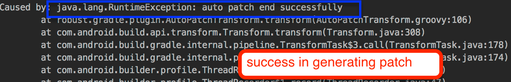

# Robust

[ ](https://bintray.com/meituan/maven/com.meituan.robust%3Apatch/0.4.99/link)
[](https://github.com/Meituan-Dianping/Robust/pulls)
[](https://raw.githubusercontent.com/Meituan-Dianping/Robust/master/LICENSE)  

Robust is an Android HotFix solution with high compatibility and high stability. Robust can fix bugs immediately without publishing apk.

 [中文说明](README-zh.md)

 More help on [Wiki](https://github.com/Meituan-Dianping/Robust/wiki)

# Environment

 * Mac Linux and Windows
 * Gradle 2.10+ , include 3.0
 * Java 1.7 +

# Usage

1. Add below codes in the module's build.gradle.

  ```java
  apply plugin: 'com.android.application'
  //please uncomment fellow line before you build a patch
  //apply plugin: 'auto-patch-plugin'
  apply plugin: 'robust'
  
  compile 'com.meituan.robust:robust:0.4.99'
  ```

2. Add below codes in the outest project's build.gradle file.

	```java
	 buildscript {
	    repositories {
	        jcenter()
	    }
	    dependencies {
	         classpath 'com.meituan.robust:gradle-plugin:0.4.99'
	         classpath 'com.meituan.robust:auto-patch-plugin:0.4.99'
	   }
	}
	```
3. There are some configure items in **app/robust.xml**,such as classes which Robust will insert code,this may diff from projects to projects.Please copy this file to your project.

# Advantages

* Support 2.3 to 10 Android OS
* Perfect compatibility
* Patch takes effect without a reboot
* Support fixing at method level,including static methods
* Support add classes and methods
* Support ProGuard,including inline methods or changing methods' signature

 

When you build APK,you may need to save "mapping.txt" and the files in directory "build/outputs/robust/".

# AutoPatch


AutoPatch will generate patch for Robust automatically. You just need to fellow below steps to genrate patches. For more details please visit website http://tech.meituan.com/android_autopatch.html

# Steps

1. Put **'auto-patch-plugin'** just behind **'com.android.application'**，but in the front of others plugins。like this:
	
	```java
	 apply plugin: 'com.android.application'
	 apply plugin: 'auto-patch-plugin'
	```
2. Put **mapping.txt** and **methodsMap.robust** which are generated when you build the apks in diretory **app/robust/**,if not exists ,create it!
3. After modifying the code ,please put annotation `@Modify` on the modified methods or invoke  `RobustModify.modify()` (designed for Lambda Expression )in the modified methods:

	```java
	   @Modify
	    protected void onCreate(Bundle savedInstanceState) {
	        super.onCreate(savedInstanceState);
	     }
	     //
	     protected void onCreate(Bundle savedInstanceState) {
	        RobustModify.modify()
	        super.onCreate(savedInstanceState);
	     }
	     
	```
	Use annotation `@Add` when you neeed to add methods or classes.
	
	```java
	    //add method
	    @Add
	    public String getString() {
	        return "Robust";
	    }
	    
	    //add class
	    
	    @Add
	    public class NewAddCLass {
	        public static String get() {
	           return "robust";
	         }
	    }
	```
4. After those steps,you need to run the same gradle command as you build the apk,then you will get patches in directory **app/build/outputs/robust/patch.jar**.
5. Generating patches always end like this,which means patches is done


# Demo Usage

## Pre Compile

The apk and patch.jar have been pre-compiled in the `app/robust` folder, and the patch effect can be previewed.

1. Install the apk in the `app/robust`.

2. Open the App, click `Jump_second_Activity`, you can see that `error occur` appears.

3. Push the patch to the specified directory

    ```java
    adb push ~/Desktop/code/robust/app/build/outputs/robust/patch.jar /sdcard/robust/patch.jar
    ```

4. Open the App and click the `Patch` button to load the patch.

5. Click `Jump_second_Activity` again, you can see `error fixed` is displayed.

## Compile by yourself (take Class ```SecondActivity``` as an example)

1. You can delete all files in `app/robust`, which are pre-compiled sample files.

2. Generate a sample apk and execute the gradle command:

   ```java
   ./gradlew clean assembleRelease --stacktrace --no-daemon
   ```

3. Install the compiled apk `app/build/outputs/apk/app-release.apk` . Save the `app/build/outputs/mapping/release/mapping.txt` file and the `app/build/outputs/robust/methodsMap.robust` file

4. After modifying the code, add **@Modify** annotation or call RobustModify.modify() method

   * Here you can modify the return value of the method ```getTextInfo()``` of the class ```SecondActivity ```, and make a patch.

5. Modify the header of the `app/build.gradle` file to use plugins.

   ```java
   // Uncomment the following line
   apply plugin:'auto-patch-plugin'
   ```

6. Put the saved **mapping.txt** and **methodsMap.robust** in the `app/robust` folder, create the folder if not exist.

7. Execute the same gradle command as the generated the sample apk:

   ```java
   ./gradlew clean assembleRelease --stacktrace --no-daemon
   ```

8. After the patch is successfully made, the apk will stop building, and a prompt similar to the following appears, indicating that the patch is successfully generated
   

9. Copy the patch file to the phone directory `/sdcard/robust`

   ```java
   adb push ~/Desktop/code/robust/app/build/outputs/robust/patch.jar /sdcard/robust/patch.jar
   ```

   The patch path `/sdcard/robust` is specified in `PatchManipulateImp`

10. Open the App and click `Jump_second_Activity` to preview the display text of the Activity before modification.

11. Click the `Patch` button to load the patch.

12. Click ` Jump_second_Activity`, you can see that the display text of Activity has been modified.

# Attentions

1. You should modify inner classes' private constructors to public modifier.
2. AutoPatch cannot handle situations which method returns **this**,you may need to wrap it like belows:

	```java
	method a(){
	  return this;
	}
	```
	changed to 
		
	```java
	method a(){
	  return new B().setThis(this).getThis();
	}
	```
3. Not Support add fields,but you can add classes currently, this feature is under testing.
4. Classes added in patch should  be static nested classes or non-inner classes,and all fields and methods in added class should be public.
5. Support to  fix bugs in constructors currently is under testing.
6. Not support methods which only use fields,without method call or new expression. 
7. Support to resources and so file is under testing.
8. For more help, please visit [Wiki](https://github.com/Meituan-Dianping/Robust/wiki)
## License

    Copyright 2017 Meituan-Dianping
    
    Licensed under the Apache License, Version 2.0 (the "License");
    you may not use this file except in compliance with the License.
    You may obtain a copy of the License at
    
       http://www.apache.org/licenses/LICENSE-2.0
    
    Unless required by applicable law or agreed to in writing, software
    distributed under the License is distributed on an "AS IS" BASIS,
    WITHOUT WARRANTIES OR CONDITIONS OF ANY KIND, either express or implied.
    See the License for the specific language governing permissions and
    limitations under the License.


